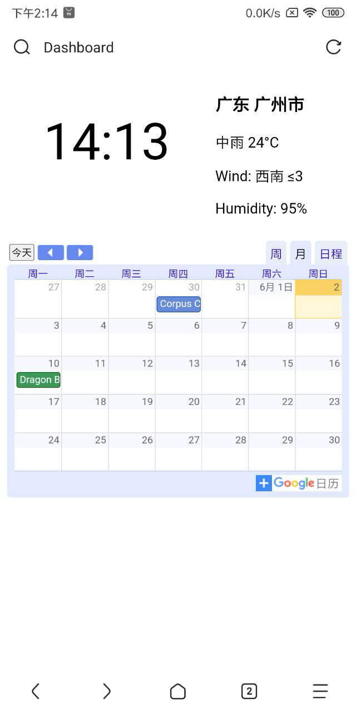

# Dashboard for all your screens

This is a configurable dashboard for all your screens. This web page is designed to show information as you configure it. You can access this webpage across all your devices.

## Features

- 📋 Dashboard showing information always standing by
- 📱 Responsive design for all your devices
- 🔋 Power efficient for always-on display (less script, resource usage)
- 🔧 Easy to configure and extensible by various widgets (feel free to contribute widgets)
- 🌐 Web-based and Accessible from anywhere (compatible with multiple platforms)
- 📦 Easy to deploy and manage (dockerized)

### Uscases

- Kindle
- Tablet
- Old phone

## Roadmap

- [x] Basic dashboard layout
- [x] Clock widget
- [x] Weather widget
- [x] Calendar widget (google calendar iframe)
- [ ] online note display widget (show contents from online note service)
